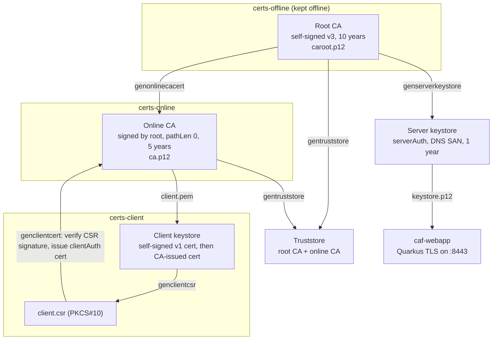

# PKI Certificate Authority in Java: Offline Root CA, Online Issuing CA, and X.509 Client Certificates

Three Java command-line tools built on Bouncy Castle model a two-tier public key infrastructure. An offline root CA signs only the online CA and the server certificate. An online CA, limited by a path length constraint, signs client certificates from certificate signing requests. A client tool generates its own key pair, requests a certificate, and installs the result. The server certificate is then deployed to a Quarkus app over TLS. Keeping the root key offline, constraining the issuing CA, and never moving a client's private key are standard ways to limit what any single stolen key can do.

## Demo

<!-- Replace the REPLACE_WITH_... placeholder with the unlisted YouTube link. -->

[Watch the demo](https://youtu.be/REPLACE_WITH_PKI_VIDEO_ID): each certificate manager command run in order, with `showcerts` before and after to show the keystore changes, then the Quarkus app serving the server certificate on https://localhost:8443.

That server certificate, from a fresh run of the command sequence below, as OpenSSL reports it:

```text
$ openssl pkcs12 -in server-keystore.p12 -nokeys | openssl x509 -noout -subject -issuer -dates \
    -ext basicConstraints,keyUsage,extendedKeyUsage,subjectAltName
subject=CN = CAF
issuer=CN = Tyler-Hackett-Offline, OU = PKI Lab, O = Tyler Hackett, C = US
notBefore=Sep 27 18:20:38 2026 GMT
notAfter=Sep 27 18:20:38 2027 GMT
X509v3 Basic Constraints: critical
    CA:FALSE
X509v3 Key Usage: critical
    Digital Signature, Key Encipherment, Key Agreement
X509v3 Extended Key Usage:
    TLS Web Server Authentication
X509v3 Subject Alternative Name:
    DNS:localhost
```

## Architecture



The root CA issues two things only: the online CA certificate and the server certificate. Day-to-day issuing happens at the online CA, and its path length of 0 means it can sign end-entity certificates but no further CAs. The client's private key stays in its keystore; only the CSR and the signed certificate move between tools.

## Security features

1. **Offline root, online issuing CA.** The root CA key signs only the online CA and server certificates and otherwise stays offline, so the key that anchors all trust never sits on a networked machine that handles requests.
2. **Constrained CA certificates.** Both CA certificates carry `basicConstraints` CA=true (critical) and `keyCertSign` and `cRLSign` key usage. The online CA adds a path length of 0 so it cannot create subordinate CAs.
3. **Role-specific end-entity certificates.** The server certificate gets `serverAuth` extended key usage and a DNS subject alternative name; client certificates get `clientAuth`. Both are marked as non-CA, so neither can be reused to sign other certificates or serve a different role.
4. **Proof of possession through CSRs.** The client signs its CSR with its own private key, and the online CA verifies that signature before issuing. The CSR can carry the client's DNS name as an extension request, but the online CA sets the certificate's SAN from its own `--dns` input instead of copying the request.
5. **Key identifiers for chain building.** Every issued certificate includes subject and authority key identifiers, so clients and servers can match each certificate to its issuer.
6. **Algorithms and lifetimes.** RSA 2048 keys from `SecureRandom`, SHA-512 with RSA signatures through the Bouncy Castle provider, and validity periods that shrink down the chain: 10 years for the root, 5 for the online CA, 1 for servers and clients.
7. **No passwords in code.** The CA tools read keystore and key passwords from environment variables, and every other keystore password is a command option. The Quarkus app reads its keystore passwords from environment variables.

## Tech stack

| Area | Tools |
|---|---|
| Language | Java 21 |
| Cryptography | Bouncy Castle 1.80 (`bcprov`, `bcpkix`), PKCS#12 keystores, PKCS#10 CSRs, PEM encoding |
| TLS deployment | Quarkus 3.31 TLS registry |
| Build | Maven (assembly plugin builds a self-contained jar per tool) |

## Repository structure

```
.
├── certs-root/pom.xml    Maven parent; modules are siblings
├── certs-base/           CAUtils (certificate and CSR builders), AppBase (keys, keystores), REPL driver
├── certs-offline/        Root CA, online CA certificate, server keystore, truststore
├── certs-online/         Signs client certificates from CSRs
├── certs-client/         Client key pair, CSR, certificate import
├── caf-webapp/           Quarkus app serving the server certificate on 8443
└── .env.example
```

## Running locally

Prerequisites: JDK 21 and Maven 3.9+.

```bash
cp .env.example .env          # choose passwords
set -a; source .env; set +a

mvn -f certs-root/pom.xml clean package
# Each tool is copied to ~/tmp/pki/certs as certs-offline.jar, certs-online.jar, certs-client.jar

mkdir -p ~/pki-demo && cd ~/pki-demo   # the CA tools keep caroot.p12 and ca.p12 in the working directory
```

The tools are interactive shells: start one with `java -jar`, type commands at its prompt, and type `quit` to leave. `help` lists every command and option, and `showcerts` prints the certificates the tool can see.

```text
$ java -jar ~/tmp/pki/certs/certs-offline.jar
certs-offline> gencaroot
certs-offline> genonlinecacert
certs-offline> exportcaroot --cert caroot.pem
certs-offline> exportonlinecacert --cert caonline.pem
certs-offline> genserverkeystore --dn CN=CAF --dns localhost --keystore server-keystore.p12 --keystorepass <SERVER_KEYSTORE_PASSWORD> --keypass <SERVER_KEY_PASSWORD> --alias server
certs-offline> gentruststore --truststore cacerts.p12 --truststorepass <TRUSTSTORE_PASSWORD>
certs-offline> showcerts
certs-offline> quit

$ java -jar ~/tmp/pki/certs/certs-client.jar
certs-client> genclientroot --dn CN=client --keystore client-keystore.p12 --keystorepass <CLIENT_KEYSTORE_PASSWORD> --keypass <CLIENT_KEY_PASSWORD> --alias client
certs-client> genclientcsr --keystore client-keystore.p12 --keystorepass <CLIENT_KEYSTORE_PASSWORD> --keypass <CLIENT_KEY_PASSWORD> --alias client --csr client.csr --dns client.local
certs-client> quit

$ java -jar ~/tmp/pki/certs/certs-online.jar
certs-online> genclientcert --csr client.csr --cert client.pem --dns client.local
certs-online> quit

$ java -jar ~/tmp/pki/certs/certs-client.jar
certs-client> importclientcert --keystore client-keystore.p12 --keystorepass <CLIENT_KEYSTORE_PASSWORD> --keypass <CLIENT_KEY_PASSWORD> --alias client --cert client.pem
certs-client> showcerts --keystore client-keystore.p12 --keystorepass <CLIENT_KEYSTORE_PASSWORD> --keypass <CLIENT_KEY_PASSWORD> --alias client
certs-client> quit
```

Deploy the server certificate:

```bash
cp ~/pki-demo/server-keystore.p12 caf-webapp/src/main/resources/keystore.p12   # gitignored
mvn -f caf-webapp/pom.xml quarkus:dev
```

Open https://localhost:8443. The browser warns that the issuer is unknown, because the root CA is not in its trust store; the certificate details show the chain back to the offline root.

## Configuration

See [.env.example](.env.example).

| Variable | Read by | Purpose |
|---|---|---|
| `CA_ROOT_KEYSTORE_PASSWORD`, `CA_ROOT_KEY_PASSWORD` | certs-offline | Open `caroot.p12` and its root CA key |
| `CA_ONLINE_KEYSTORE_PASSWORD`, `CA_ONLINE_KEY_PASSWORD` | certs-offline, certs-online | Open `ca.p12` and the online CA key |
| `SERVER_KEYSTORE_PASSWORD`, `SERVER_KEY_PASSWORD` | caf-webapp | Open `keystore.p12` for TLS |

Server, client, and truststore passwords are command options typed at the tool prompt. The distinguished names for the two CAs are set in `certs-offline/src/main/resources/config.properties`.

## Trying it

There are no user accounts. Run the sequence above, then:

1. Run `showcerts` in certs-offline and certs-online before and after each command to watch the keystores change.
2. Inspect the outputs with OpenSSL, for example `openssl x509 -in client.pem -noout -text` to see `clientAuth`, the key identifiers, and the issuer.
3. Verify the chain: `openssl verify -CAfile caroot.pem -untrusted caonline.pem client.pem`.
4. Open https://localhost:8443 and view the certificate in the browser.

## Key takeaways

<!-- REVIEW: drafted from the code. Edit to match your own experience before publishing. -->

- **Extensions carry the policy.** A certificate is only as constrained as its extensions. Getting `basicConstraints`, key usage, extended key usage, and the SAN right for each role is what stops a leaf certificate from acting as a CA or a client certificate from serving TLS.
- **The CSR is the trust boundary.** The online CA never sees the client's private key. Verifying the CSR signature proves the requester holds the key, and the CA decides what goes into the certificate instead of copying whatever the request asks for.
- **Path length is a cheap, strong control.** Setting path length 0 on the online CA means a stolen online CA key can issue leaf certificates but cannot mint a new intermediate CA.
- **Key identifiers make chains work.** Subject and authority key identifiers let OpenSSL and browsers link each certificate to its issuer without relying on name matching alone.
- **Bouncy Castle's builder API maps closely to X.509.** Building v1 and v3 certificates by hand with `X509v3CertificateBuilder` and `PKCS10CertificationRequestBuilder` made the structure of certificates and CSRs concrete in a way `keytool` hides.

## Known issues and hardening ideas

- Serial numbers come from `SecureRandom.nextLong()`, which can be negative. RFC 5280 requires positive serial numbers, so a production version should use a positive random `BigInteger` of at least 64 bits.
- `importclientcert` stores the issued certificate without checking that its public key matches the client's private key or that it chains to the online CA.
- There is no revocation support (CRL or OCSP), and the online CA does not keep a record of issued certificates.

## Attribution

The REPL driver, utilities, crypto wrapper classes, command and option definitions, Maven build, and the one-page Quarkus app came from a provided starter codebase. I implemented certificate and CSR construction in `CAUtils`, key generation and keystore handling in `AppBase`, and the command logic in the offline, online, and client tools. Generated keystores, certificates, and CSRs are not in the repo.
